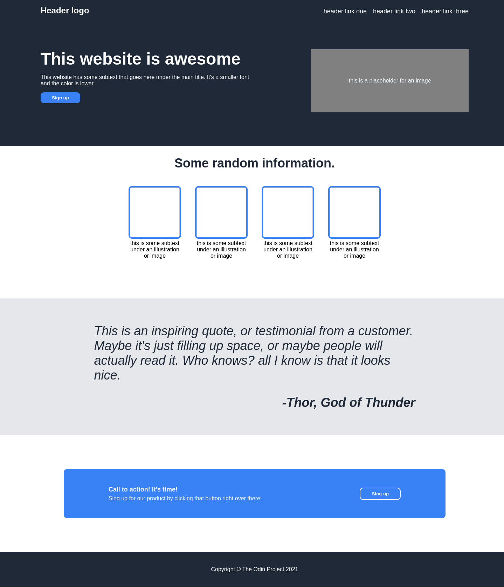

# Landing Page

A simple, responsive landing page built using HTML and CSS as part of [The Odin Project](https://www.theodinproject.com/).

## 🚀 Live Demo
[Live Demo](#) ()

## 📌 Features
- Responsive layout with Flexbox
- Navigation bar with links
- Hero section with call-to-action
- Quote/testimonial section
- Footer section

## 🛠 Technologies Used
- HTML5
- CSS3 (Flexbox)

## 📥 Installation
1. Clone the repository:
   ```bash
   git clone https://github.com/VazquezCuervo/landing-page.git

2. Navigate to the project folder:
    gicd landing-page

3.  Open index.html in your browser.

## 📖 Usage

- Modify index.html to change the content.
- Customize styles in style.css.

## 📸 Screenshot



## 📝 License

This project is licensed under the MIT License.